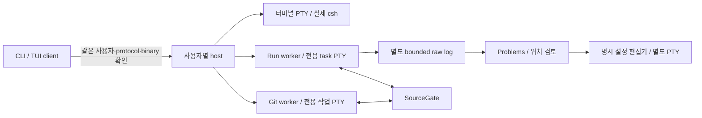

# idk v0.4 구조

제품은 `crates/idk/`의 Rust CLI/TUI와 사용자별 백그라운드 host로 구성한다. 기본 실행에
Python, Zellij, GUI 서버나 사외 서비스가 필요하지 않다. 선택 근거와 측정 예산은
[ADR 0001](adr/0001-native-terminal-foundation.md), 검증은 [개발 안내](development.md)를 따른다.

## 실행 경계

UI의 수명과 host/셸의 수명은 다르다. client를 닫아도 host가 실제 셸과 출력 수집을 유지하며,
재접속은 기존 runtime identity와 화면을 사용한다. 같은 csh/tcsh에서 source한 상태를 계속
사용하고, 접속 때문에 초기화를 반복하지 않는다. 종료한 터미널은 명시적으로 다시 열 때만
새 셸로 초기화한다.

프로젝트는 Git 대상과 초기화 정의를 소유한다. 터미널은 프로젝트 소속을 유지하면서 프로젝트
밖의 테스트 cwd를 가질 수 있다. 현재 terminal cwd가 바뀌었다고 Git 작업 대상을 바꾸지 않는다.

## 주요 모듈

| 코드 | 책임 |
|---|---|
| `main.rs`, `cli_project.rs`, `cli_session.rs`, `cli_run.rs`, `cli_package.rs` | 명령 파싱과 명시적 작업 진입 |
| `ui/`, `client.rs`, `protocol.rs` | TUI, 제한된 요청/응답, peer와 binary identity, 입력 소유권/epoch |
| `model.rs`, `project.rs`, `store.rs` | 저장 정의·검토 revision·SourceGate·private 상태와 원자적 파일 교체 |
| `shell.rs`, `terminal.rs`, `host/` | 실제 csh startup/source, PTY, 비동기 준비, 출력 수집, 관찰한 exit/cleanup |
| `git/`, `git_wire.rs`, `host/git_*` | 실제 저장소 binding, immutable review/plan, index와 Git 작업 수명 |
| `task.rs`, `run.rs`, `run_wire.rs`, `host/run_jobs.rs` | 등록 실행 의도, 결과·취소, source lease, 로그·retention |
| `problems.rs`, `editor.rs` | raw-log 기반 진단, provenance, 승인된 현재/기록 root와 편집기 인자 |
| `package.rs`, `install.rs`, `doctor.rs` | archive 검증, generation 활성화/복구, 현지 진단 |
| `probe*.rs` | 배포된 실행 파일 자체가 수행하는 합성 셸/host/Git/Run 증거 |

worker는 느린 파일/Git/초기화 작업을 actor 밖에서 처리한다. host는 실제 소유한 프로세스와
입력 권한을 추적한다. 같은 session의 자손 정리와 실제 leader exit를 확인한 뒤에만 완료와
source lease 해제를 연결한다. 별도 session으로 이탈한 프로세스까지 소유했다고 주장하지 않는다.

## 상태와 결과의 의미

설정, host tombstone, Git operation, Run metadata/log는 서로 다른 기록이다. 실행 의도와
취소 요청은 실제 동작과 구분해 저장한다. 복구 시 저장 PID를 채택하거나 명령을 재실행하지
않으며 불확실한 실행은 Unknown으로 남긴다. 외부 확인에 따른 명시적 cleanup acknowledgement도
실행 결과를 성공으로 바꾸지는 않는다.

Git status/index review와 실제 실행 계획은 구분한다. stage 선택은 원래 파일 경로 bytes를
사용하며 commit review는 선택 목록이 아닌 실제 전체 index를 보여 준다. source 변경과 등록
Run은 같은 저장소 identity의 gate를 공유한다. 다른 client나 외부 Git 프로세스에 대해 확인하지
못한 사실은 보장으로 확대하지 않는다.

Run의 raw log는 terminal scrollback과 별개이고 크기·큐·보관 한도가 있다. 손실/만료/쓰기 실패는
부분 기록으로 표시한다. Problems는 실제 log offset과 run/source generation을 유지한다.
잘못된 인코딩이나 제어문자로 파일 identity가 모호해지면 다른 파일명으로 바꾸어 열지 않는다.
편집기는 검토한 별도 argv로 실행하며 기존 작업 셸에 명령을 주입하지 않는다.

현재 SHA·dirty 관찰·artifact 경로는 소스 snapshot 또는 테스트 바이너리 bytes 증명이 아니다.
실제 exit, 진단 severity와 관찰 범위의 미확인을 각각 표시한다.

## 저장과 배포

v0.4는 XDG의 `idk/v0.4` namespace와 private host-local runtime을 사용한다. SQLite/WAL을
사용하지 않는다. state/runtime에서 NFS를 확인하면 시작을 거부한다. 사용자가 허용된 로컬
XDG 경로나 `--data-dir`를 명시적으로 선택하며, 소스/config나 기존 state를 자동 이주하지 않는다.
statfs 조회 실패도 거부하고, 다른 파일시스템의 잠금·rename·fsync 지원까지 추정하지 않는다.
경로·schema·설치 수명 상세는 [오프라인 운영 안내](offline-workspace.md)에 있다.

정적 musl binary, manifest, checksum, 라이선스 inventory와 원문을 다섯 파일의 USTAR/gzip
bundle로 만든다. 설치는 새 generation을 검증하고 journal로 managed link를 전환한다.
기존 host와 generation, 살아 있는 셸·Run·로그 writer, 실행 중 바뀐 사용자 데이터는
복구 시에도 보존한다. 업데이트의 health 검사는 typed host/Git/Run metadata를 읽고 검증하며
등록 작업을 실행하거나 live 상태의 이전 snapshot을 복원하지 않는다. 설치 schema 2의
committed version floor는 uninstall 뒤에도 유지하며 stage/건강 검사 실패로 올라가지 않는다.

공개 빌드 도구의 Python과 제품 런타임을 구분한다. 릴리스는 성공한 exact-main native CI의
artifact를 재빌드하지 않고 승격하며 [릴리스 프로토콜](native-release.md)로 검증한다.

## 변경할 때

새 동작은 어느 정의·runtime·소유권·저장 계약을 바꾸는지 먼저 정한다. UI/CLI 배선과
실행/실패 검증, 사용 문서를 같은 PR에서 연결한다. 종료·취소·복구를 mock 결과만으로
완료 처리하지 않는다. 기존 v0.3 Python 구조와 서브커맨드 추가법은 Git history의 해당 버전을
참조하며 현재 제품 경로로 다시 가져오지 않는다.

대상 RHEL·폐쇄망 정책 수용은 [공개 후 사용자 실기 #53](https://github.com/jihoon22-lee/idk/issues/53)에
미실행으로 남긴다. 합성 storage 오류 주입은 실제 NFS 마운트나 현지 정책의 수용 증거가 아니다.
